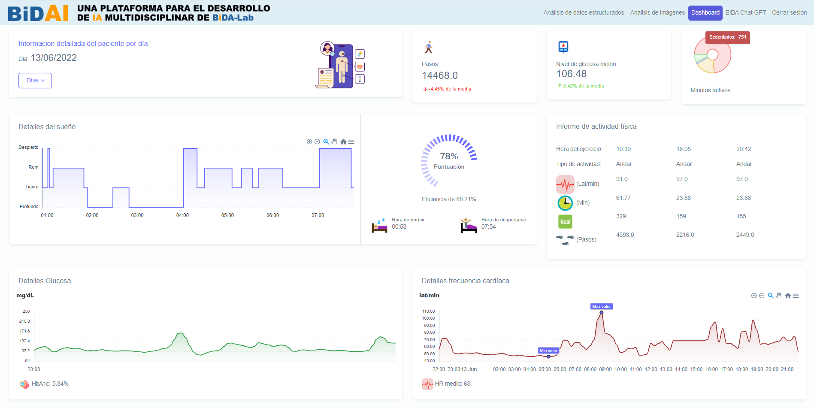
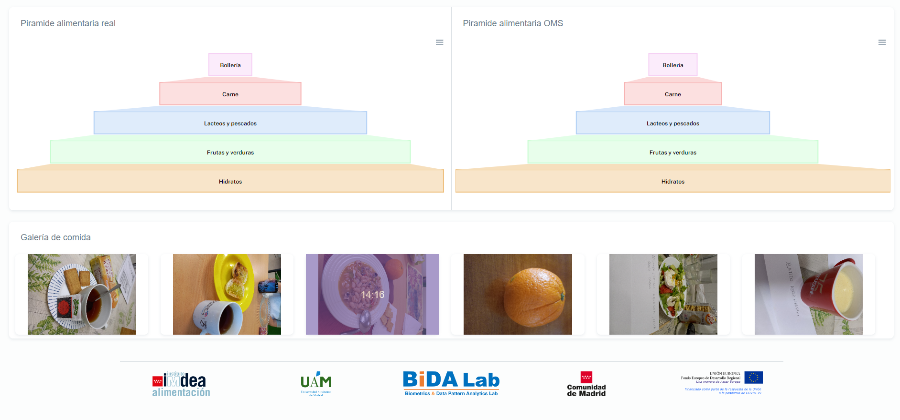

# Dashboard
DASHBOARD for personalized e-Health nutrition and lifestyle

## Table of contents
- Introduction
- AI4FoodDB
- Tools
- Dashboard
- References

## Introduction

The AI4Food framework has recruited 100 overweight or obese individuals through the application of validated questionnaires, wearable devices, body measurements and analysis of biological samples. The purpose is to track their lifestyle and health status during a one-month weight loss programme. The goal is to develop a detailed profile of the human body, known as a "digital twin", using the latest technologies and tools that monitor biological, physiological and behavioural data.

The combination of diverse data is expected to identify complex biological markers, moving beyond the traditional approach based solely on dietary surveys. The AI4Food framework thus seeks to advance digital health by developing artificial intelligence technologies that facilitate automated and accurate patient monitoring.

To date, AI4FoodDB represents the first public database that centralises food images, wearable device data, validated surveys and biological samples from a single intervention programme. As a result, this database is expected to enhance the current paradigm of personalised nutrition and deepen the understanding of the human body's behaviour in chronic diseases.

The acquisition of AI4FoodDB was jointly conducted by the IMDEA Food Institute from Madrid, Spain, and the Biometrics and Data Pattern Analytics Laboratory from Universidad Autonoma de Madrid (UAM), Madrid, Spain. 

All information on patient data capture, the data collection protocol and the complete database structure can be found in paper [1]. For the data visualization component, a Demo DASHBOARD tool has been developed to showcase the data collected for AI4Food.

## AI4FoodDB
In this section I will name and make a brief explanation about the data of the datasets that have been shown in the dashboard. As I said before, the information about the rest of the datasets can be found in the paper [1].

Dataset 3: Nutrition - Participants were requested to capture images of all food and drinks consumed during the 2-week digital data collection.

Dataset 4: Biomarkers - Genetic information a series of single-nucleotide polymorphisms associated with metabolism, nutrition and immune system deterioration were measured. Additionally, the Glucose Management Indicator, which indicates the average AC1 level based on the average glucose level, glucose variability and coeffcient of variation of all readings logged over 2 weeks

Dataset 6: Vital signs - It records HR, it is recorded for each participant every 5 s as beats per minute (bpm).

Dataset 7: Physical activity - this provides detailed reports of any physical activity. Calories, distance, duration, speed and additional specifc information are included for each activity. During each day, active minutes indicates the duration of physical activity based on four different activity levels: from sedentary and light activity to moderate and very active exercise. Also other additional data like calories burned per day, altitude, daily steps taken and distance covered per day.

Dataset 8: Sleep activity - The sleep-related features captured by the device are sleep quality with an overall score, efficiency sleeping time in bed and also information about the start and end time of sleep, the duration of different sleep stages and time spent in bed.

## Tools
To implement the dashboard, the Django web development framework was utilized. Customization and adaptation to display each user's desired content were achieved through the use of HTML, while visual appeal was enhanced employing CSS and Bootstrap.

## Dashboard

Following the storage of information in different repositories, we enter the main screen of the dashboard. The main screen displays part of the patient's information contrasted with the population average, which in this case comprises the 100 patients from whom data collection was conducted. This initial information consists of general data and various datasets from AI4FoodDB. The genetic information extracted from the Biomarkers Dataset. It allows us to compare the patient's genetic profile with the population mode, or in other words, what is most common among the rest of the patients and identify any anomalies in any gene.

Next, a radar chart with normalized values is presented, where parameters such as average glucose value, average HR, Moderate to Vigorous Physical Activity (MVPA), duration, and sleep score are compared. Alongside, real values obtained directly from various data acquisition methods are displayed. This provides a very general overview of differences at a high level. Additionally, sleep information divided into different stages is included, providing insights into the average sleep quality as well. The different stages 

If we keep scrolling down the screen, we'll find a dropdown menu to select the day we want to visualize the data for. Then, we'll get the steps taken by the person on that day and the average glucose level for the day. These data are marked with a green or red arrow indicator depending on whether that value is above or below their own average. Next, there's a donut chart indicating the complete minutes of the day, with sedentary minutes in red, slightly active minutes in yellow, moderate minutes in purple, and active minutes in green.

Afterward, we have sleep details, where we see a hypnogram representing the different sleep phases over time. Additional sleep data from the AI4FoodDB section are also displayed. Additionally, there's a physical activity report gathering data on different activities performed on that day, including the time, type, average heart rate during the activity, duration, and calories burned.

Furthermore, there are two continuous signals showing glucose and heart rate details. Additionally, the Glycated Hemoglobin (HbA1c) test result and the average heart rate are indicated.

To conclude, we find the food pyramid that the patient should have for that day following the guidelines of the OMS, and to the right, the food pyramid based on the recorded dietary intake during data collection for the day selected. This allows for comparison to identify if the patient lacks any food group from the pyramid. Finally, all the images uploaded by the user to the application appear, along with the indicated time for consuming the food.

## References
 - [1] [AI4FoodDB: a database for personalized e-Health nutrition and lifestyle through wearable devices and artificial intelligence](https://academic.oup.com/database/article/doi/10.1093/database/baad049/7226275?login=true))
