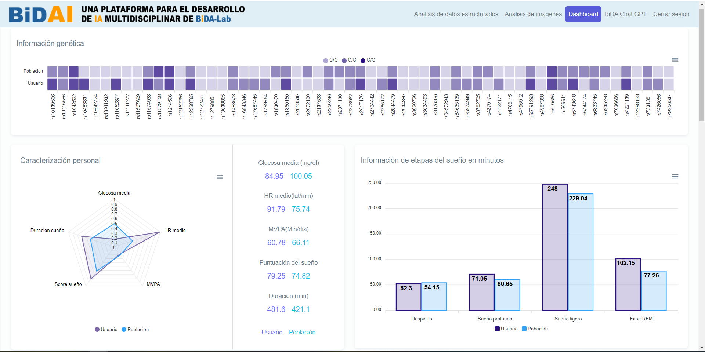

# Dashboard
DASHBOARD for personalized e-Health nutrition and lifestyle

## Table of contents
- Introduction
- AI4FoodDB
- Tools
- Dashboard
- References

## Introduction

The AI4Food project: Artificial Intelligence for the Prevention of Chronic Diseases through Personalized Nutrition, currently active and led by the BidaLab research group, has involved my participation in a dashboard platform designed to give visualisation to the AI4Food database.

The increasing prevalence of diet-related diseases necessitates an enhancement in nutritional guidance. Personalized nutrition endeavors to address this issue by tailoring dietary and lifestyle recommendations to the specific circumstances of each individual. Leveraging the latest advancements in technology and data science, researchers can now automatically gather and analyze extensive datasets from various sources, including wearable and smart devices [1].

For the data visualization component, a Demo DASHBOARD tool has been developed to showcase the data collected during the weight loss intervention period.

## AI4FoodDB

## Tools
To implement the dashboard, the Django web development framework was utilized. Customization and adaptation to display each user's desired content were achieved through the use of HTML, while visual appeal was enhanced employing HTML and CSS.

## Dashboard

Following the storage of information in different repositories, we enter the main screen of the dashboard. The main screen displays part of the patient's information contrasted with the population average, which in this case comprises the 100 patients from whom data collection was conducted. This initial information consists of general data and various datasets from AI4FoodDB. The genetic information extracted from the Biomarkers Dataset represents a series of single-nucleotide polymorphisms associated with metabolism, nutrition, and immune system deterioration. It allows us to compare the patient's genetic profile with the population mode, or in other words, what is most common among the rest of the patients and identify any anomalies in any gene.

Next, a radar chart with normalized values is presented, where parameters such as average Glucose value, average HR, Moderate to Vigorous Physical Activity (MVPA), duration, and sleep score are compared. Alongside, real values obtained directly from various data acquisition methods are displayed. This provides a very general overview of differences at a high level. Additionally, sleep information divided into different stages is included, providing insights into the average sleep quality as well.

## References
 - [1] [AI4FoodDB: a database for personalized e-Health nutrition and lifestyle through wearable devices and artificial intelligence](https://academic.oup.com/database/article/doi/10.1093/database/baad049/7226275?login=true))
