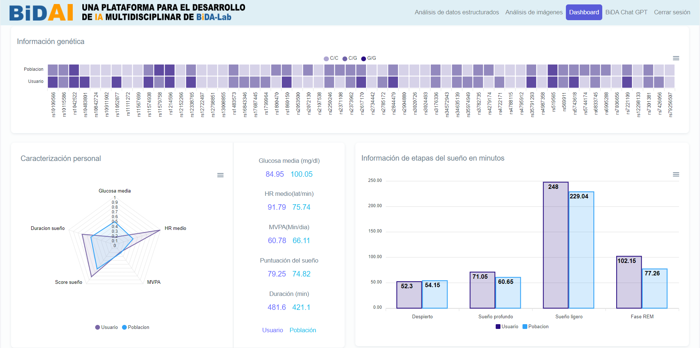

# Dashboard
DASHBOARD for personalized e-Health nutrition and lifestyle

## Table of contents
- Introduction
- AI4FoodDB
- Tools
- Dashboard
- References

## Introduction

The AI4Food framework has recruited 100 overweight or obese individuals through the application of validated questionnaires, wearable devices, body measurements and analysis of biological samples. The purpose is to track their lifestyle and health status during a one-month weight loss programme. The goal is to develop a detailed profile of the human body, known as a "digital twin", using the latest technologies and tools that monitor biological, physiological and behavioural data.

The combination of diverse data is expected to identify complex biological markers, moving beyond the traditional approach based solely on dietary surveys. The AI4Food framework thus seeks to advance digital health by developing artificial intelligence technologies that facilitate automated and accurate patient monitoring.

To date, AI4FoodDB represents the first public database that centralises food images, wearable device data, validated surveys and biological samples from a single intervention programme. As a result, this database is expected to enhance the current paradigm of personalised nutrition and deepen the understanding of the human body's behaviour in chronic diseases.

The acquisition of AI4FoodDB was jointly conducted by the IMDEA Food Institute from Madrid, Spain, and the Biometrics and Data Pattern Analytics Laboratory from Universidad Autonoma de Madrid (UAM), Madrid, Spain. 

All information on patient data capture, the data collection protocol and the complete database structure can be found in paper [1]. For the data visualization component, a Demo DASHBOARD tool has been developed to showcase the data collected for AI4Food.

## AI4FoodDB

## Tools
To implement the dashboard, the Django web development framework was utilized. Customization and adaptation to display each user's desired content were achieved through the use of HTML, while visual appeal was enhanced employing HTML and CSS.

## Dashboard

Following the storage of information in different repositories, we enter the main screen of the dashboard. The main screen displays part of the patient's information contrasted with the population average, which in this case comprises the 100 patients from whom data collection was conducted. This initial information consists of general data and various datasets from AI4FoodDB. The genetic information extracted from the Biomarkers Dataset represents a series of single-nucleotide polymorphisms associated with metabolism, nutrition, and immune system deterioration. It allows us to compare the patient's genetic profile with the population mode, or in other words, what is most common among the rest of the patients and identify any anomalies in any gene.

Next, a radar chart with normalized values is presented, where parameters such as average Glucose value, average HR, Moderate to Vigorous Physical Activity (MVPA), duration, and sleep score are compared. Alongside, real values obtained directly from various data acquisition methods are displayed. This provides a very general overview of differences at a high level. Additionally, sleep information divided into different stages is included, providing insights into the average sleep quality as well.

## References
 - [1] [AI4FoodDB: a database for personalized e-Health nutrition and lifestyle through wearable devices and artificial intelligence](https://academic.oup.com/database/article/doi/10.1093/database/baad049/7226275?login=true))
